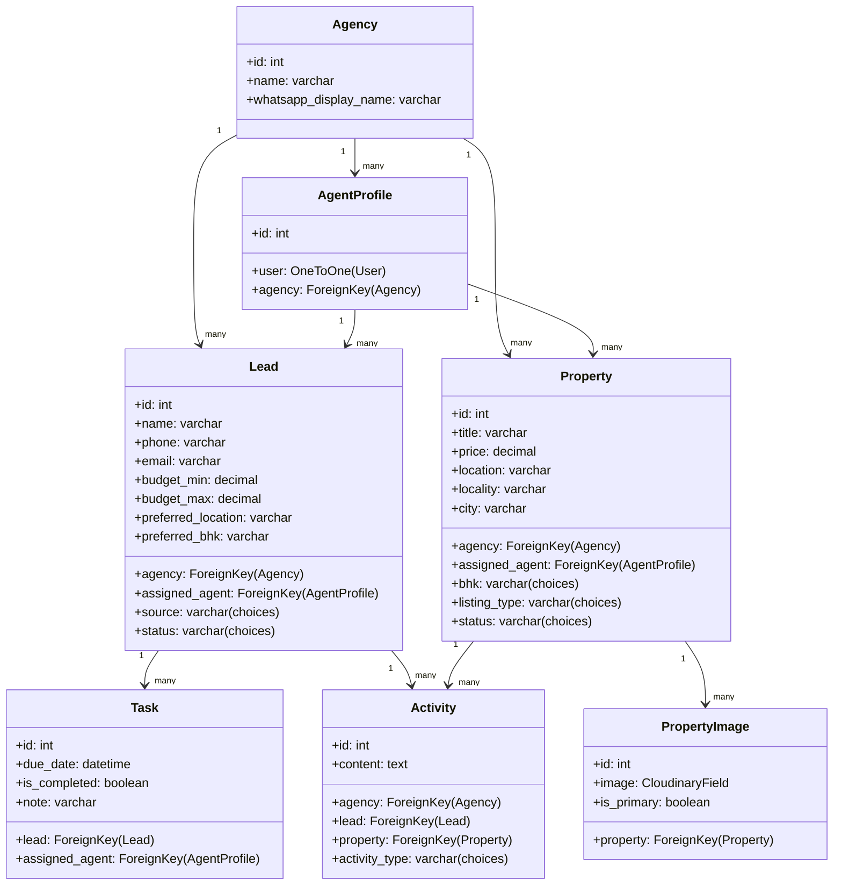
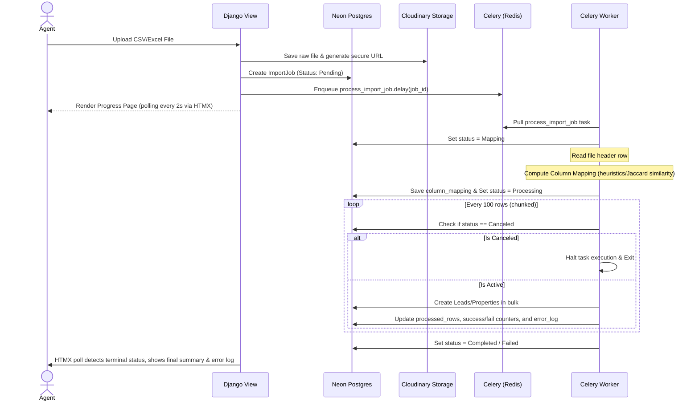

# LeadSathi — System Architecture & Design Specification

This document provides a comprehensive technical overview of the current system architecture, database design, core engine logic, and feature workflows for **LeadSathi**.

---

## 1. System Overview

LeadSathi is a multi-tenant Real Estate SaaS application designed for agencies to capture leads, track property listings, auto-match buyer preferences with available inventory, and engage clients using automated communication channels.

### Tech Stack
*   **Backend:** Django (Python 3.13)
*   **Database:** PostgreSQL (Hosted on Neon DB)
*   **Task Queue:** Celery (leveraging Redis as the broker and result store)
*   **Storage:** Cloudinary (for property images and raw import files)
*   **Frontend:** Django templates with HTML5, CSS3, Tailwind CSS (for styling), and HTMX (for dynamic, interactive UI updates without full page reloads)
*   **Integrations:** WhatsApp Business Cloud API (messaging/verification), Resend (emails)

---

## 2. Database & Data Model Design

The application enforces strict **multi-tenancy** scoped to an `Agency`. Most core models inherit from an agency-scoped design, managed by a custom `AgencyScopedManager`.



### Core Models

#### `Lead`
Represents prospective buyers or tenants.
*   **Preferences:** Tracks desired BHK, location, budget range (`budget_min` / `budget_max`), and property type.
*   **Lifecycle Statuses:** `New` &rarr; `Contacted` &rarr; `Qualified` &rarr; `Site Visit` &rarr; `Negotiation` &rarr; `Converted` &rarr; `Lost`.

#### `Property`
Represents real estate inventory.
*   **Attributes:** Address, city, locality, price, BHK, area size, amenities list (stored as a JSON list).
*   **Listing Types:** `Sale` or `Rent`.
*   **Status:** `Available`, `Pending`, `Sold`, `Rented`.

#### `Task` (Follow-Ups)
Core follow-up scheduling unit linked to a `Lead` and an `AgentProfile`.
*   **Attributes:** `due_date` (datetime), `is_completed` (boolean), `note` (character field).
*   **Reminders:** Scheduled via `send_followup_reminder` which dispatches email alerts to the assigned agent when tasks are near their due dates.

#### `Activity`
A persistent historical log of client engagement (Calls, Emails, Notes, WhatsApp messages, or Status changes).

---

## 3. Core Feature Workflows

### A. Lead Import System (Phase 5.5)

Designed to process bulk CSV/Excel uploads of leads or properties with zero-click automation.



#### 1. File Handling & Storage
To bridge the web process and background tasks, the system uses a custom `ImportFileStorage` backend:
*   In production, files are uploaded directly to **Cloudinary** (Raw storage). The public URL is saved in `file_url`.
*   The worker uses `requests.get(job.file_url)` to download the file directly in-memory, avoiding the need for shared file systems.

#### 2. Zero-Click Column Auto-mapping
Uploaded column headers are mapped to Django model fields automatically via Jaccard similarity and confidence scoring thresholds:
*   Normalized headers (lowercased, stripped of spaces/underscores) are compared to expected field aliases.
*   Maps standard columns (e.g., "Full Name", "Contact Number", "BHK Pref") to exact database fields (`name`, `phone`, `preferred_bhk`).

#### 3. Interruption / Cancellation Flow
*   When a user clicks "Cancel Import", it triggers a POST to `/imports/<id>/cancel/`, changing the database job status to `canceled`.
*   The Celery loop checks `job.refresh_from_db()` before processing every chunk of 100 rows. If it detects `CANCELED`, it immediately terminates execution, saving progress up to that point.

---

### B. Auto-Matching Engine

Compares buyer preferences (Leads) with inventory (Properties) to calculate match scores.

*   **Scoring Metrics:**
    *   **BHK Preference (40% weight):** Exact match gets 100% score; adjacent configuration (e.g., ±1 BHK) gets partial 50% score.
    *   **Budget (35% weight):** Prices inside the lead's budget range get 100% score; prices within 15% tolerance outside the range get partial 50% score.
    *   **Location (25% weight):** Calculated by matching locality and city preferences.
*   **Threshold:** Matches with a combined score **> 0.30** are suggested to agents.

---

### C. WhatsApp Integration & Follow-Ups

Enables automatic lead capture and automated conversational flow.

#### 1. Inbound Conversation State Machine (`WhatsAppConversation`)
Route inbound messages through states to collect buyer profiles:
1.  `STARTED` &rarr; Send Welcome message, ask for name.
2.  `ASKED_NAME` &rarr; Save name, ask for budget.
3.  `ASKED_BUDGET` &rarr; Parse/save budget range, ask for BHK.
4.  `ASKED_BHK` &rarr; Parse/save BHK, ask for location.
5.  `ASKED_LOCATION` &rarr; Save location preference, create `Lead` in database, mark `COMPLETED`, and notify agent.

#### 2. Outbound WhatsApp Follow-Ups
Agents can trigger templates (such as `lead_follow_up`) directly from a lead's page. The system sends the message via Meta's WhatsApp API and logs an `Activity` entry on the lead.

---

## 4. Production Deployment Design (Render)

For smooth execution on Render's platform:
*   **Broker & Result Backend:** Both `CELERY_BROKER_URL` and `CELERY_RESULT_BACKEND` default to `REDIS_URL`.
*   **SSL Configuration:** Automatic SSL parameters are initialized for `rediss://` secure Redis connections:
    ```python
    if CELERY_BROKER_URL.startswith("rediss://"):
        CELERY_BROKER_USE_SSL = {"ssl_cert_reqs": "CERT_NONE"}
        CELERY_REDIS_BACKEND_USE_SSL = {"ssl_cert_reqs": "CERT_NONE"}
    ```
*   **Celery Worker Execution:**
    Runs as a standalone **Background Worker** on Render using the following startup sequence:
    `cd leadrescue && celery -A config worker --loglevel=info`
